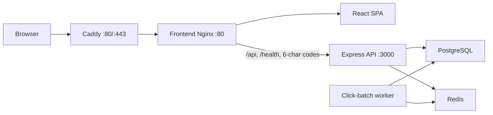
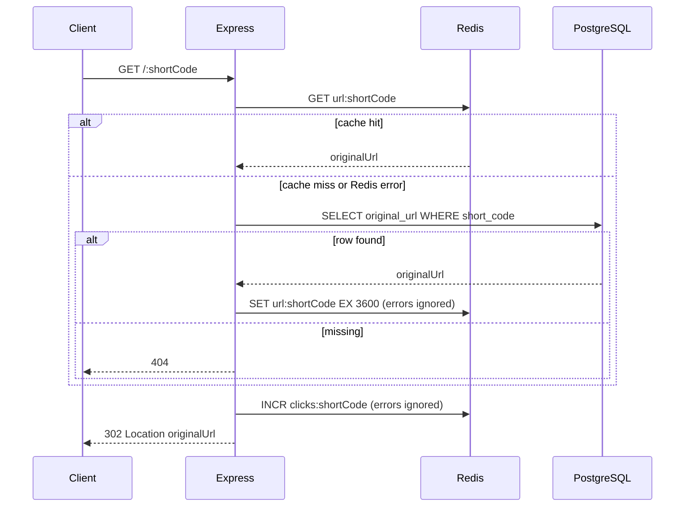
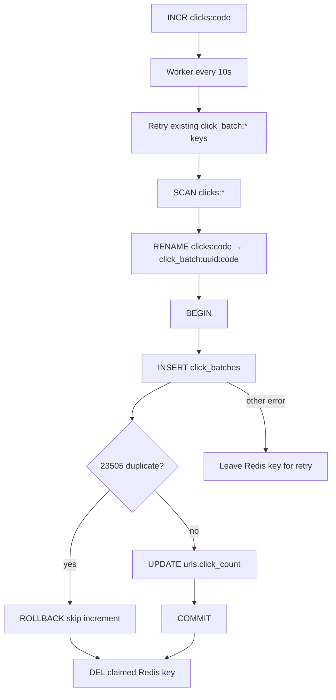
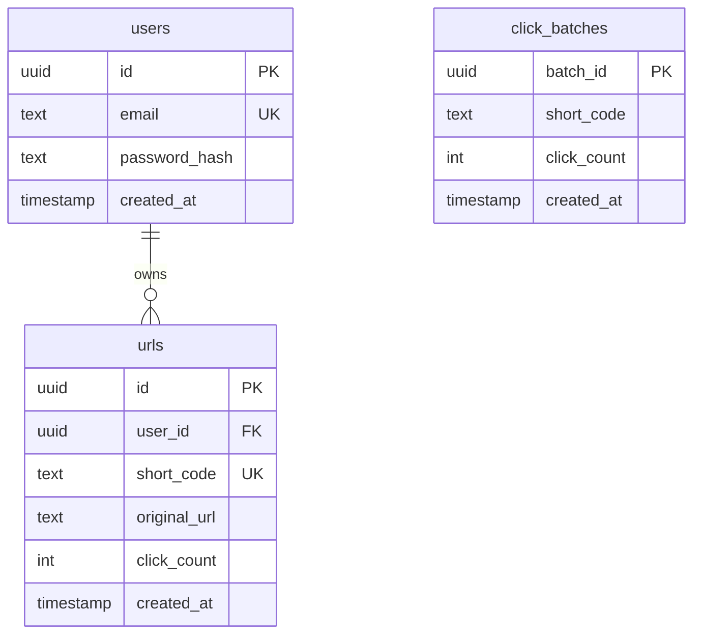
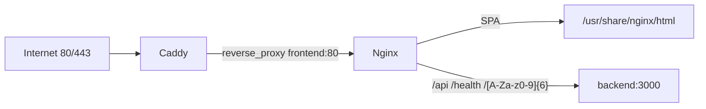

# URL Shortener

A full-stack URL shortener: authenticated users create short links, anyone can follow them, and click counts are recorded without writing to PostgreSQL on every redirect.

The public path (`GET /:shortCode`) must stay fast and available. Lookups use Redis with a PostgreSQL fallback. Clicks are incremented atomically in Redis, then a background worker claims batches and persists them to PostgreSQL in an idempotent transaction.

## Features

Implemented in this repository:

- Email/password signup, login, and logout
- Session authentication via an HTTP-only `sessionId` cookie stored in Redis
- Authenticated URL create, list, stats, and delete
- Random 6-character short codes with unique-constraint retries
- Unauthenticated `302` redirects
- Redis cache-aside for original URL lookup (1 hour TTL)
- Redis `INCR` click counters that do not block redirects on failure
- Background click-batch worker (10s interval) with atomic Redis `RENAME` claiming
- Idempotent PostgreSQL click-batch persistence
- React dashboard (create, list, copy, stats modal, confirmed delete)
- Docker Compose for local PostgreSQL/Redis
- Production Compose: migrate job, backend, frontend Nginx, Caddy TLS, private network
- Backend health check for PostgreSQL and Redis

Not claimed here (see [Future Improvements](#future-improvements)): rate limiting, Helmet/CSP, CI/CD, distributed queues, replicas/load-balanced API processes.

## Tech Stack

| Layer | Technology | Why it is used |
| --- | --- | --- |
| Frontend | React 19, React Router 7, Vite 7 | SPA for auth and dashboard; Vite proxies `/api` in development |
| Frontend (prod) | Nginx 1.28 | Serves the Vite build and same-origin-proxies `/api`, `/health`, and 6-character short codes |
| Backend | Node.js, Express 5 | HTTP API, redirects, and in-process click worker |
| Database | PostgreSQL 16 | Durable users, URLs, and aggregated click counts |
| Migrations | node-pg-migrate | Versioned schema in `backend/migrations` |
| Cache / sessions / counters | Redis 7, node-redis 6 | Sessions, URL cache, atomic click counters, batch keys |
| Auth hashing | bcrypt (10 rounds) | Password hashes at rest |
| Cookies | cookie-parser | Reads/writes the `sessionId` cookie |
| Dev containers | Docker Compose (`docker-compose.yml`) | Local Postgres + Redis with host ports |
| Prod containers | `docker-compose.prod.yml`, Dockerfiles | App + data stores on a private network |
| TLS / edge proxy | Caddy 2 (`caddy:2-alpine`) | Host ports 80/443; reverse-proxies to frontend Nginx |

## Architecture



In **development**, the Vite dev server (port 5173) proxies `/api` to `http://localhost:3000`. Redirects are called on the backend origin (`BASE_URL`, default `http://localhost:3000`). Caddy is not used locally.

In **production**, only Caddy is published. It forwards all HTTP(S) for `manish-urlshortener.duckdns.org` to `frontend:80`. Nginx then splits SPA routes vs API vs short codes. PostgreSQL and Redis have **no host ports**.

The click worker is **not** a separate container. `backend/src/app.js` starts it in the same Node process when the file is the main module (`node src/app.js`).

### Request flows

**1. Create a short URL**  
Authenticated `POST /api/urls` with `{ originalUrl }`. `requireAuth` loads `userId` from Redis via the cookie. `urlService` validates `http:`/`https:`, generates a 6-character code, inserts into `urls`. Unique `short_code` violations are retried up to 5 times.

**2. Redirect**  
`GET /:shortCode` (no auth). Resolve original URL (Redis `url:` then PostgreSQL). On success, Redis `INCR clicks:<code>` (errors logged, redirect still happens). Respond `302`.

**3. Record a click**  
Only after a successful resolve. Missing codes return 404 and **do not** increment.

**4. Click batches**  
Every 10s the worker SCANs `click_batch:*` (retry leftover claims), then `clicks:*`. Each live counter is `RENAME`d to `click_batch:<uuid>:<shortCode>`, then inserted into `click_batches` and added to `urls.click_count` in one transaction.

**5. Statistics**  
`GET /api/urls/:id/stats` is owner-scoped. `clickCount` is PostgreSQL `urls.click_count` (durable aggregate), **not** the live Redis counter. Recent clicks may lag until the next successful flush.

**6. Session validation**  
`requireAuth` reads cookie `sessionId`, `GET session:<id>` in Redis. Missing/expired → `401 Unauthorized`.

## Repository Structure

```
url-shortner/
├── backend/                 Express API, worker, migrations, tests
│   ├── src/app.js           App wiring, /health, shutdown, worker start
│   ├── src/routes/          auth, urls, redirect
│   ├── src/controllers/
│   ├── src/services/        auth, sessions, URLs, redirects, click increment
│   ├── src/middleware/requireAuth.js
│   ├── src/db/              pg pool, redis, sessions, urls, cache, counters, batches
│   ├── src/workers/clickBatchWorker.js
│   ├── migrations/
│   ├── tests/               node:test suites
│   ├── test-concurrency.js  Manual click-batch concurrency script
│   └── Dockerfile
├── frontend/                Vite + React
│   ├── src/pages/           Login, Signup, Dashboard
│   ├── src/context/AuthContext.jsx
│   ├── src/api/api.js
│   ├── nginx.conf           Production SPA + proxy rules
│   └── Dockerfile
├── deploy/
│   ├── caddy/Caddyfile
│   └── redis/redis.conf     AOF/RDB; password is not stored here
├── docker-compose.yml       Dev Postgres + Redis (ports 5432, 6379)
├── docker-compose.prod.yml  Full production stack
└── .env.production.example  Production variable names (no real secrets)
```

## Backend Architecture

Layering: **route → controller → service → db**.

| Path | Role |
| --- | --- |
| `POST /api/auth/signup`, `login`, `logout`; `GET /api/auth/me` | Auth |
| `POST/GET /api/urls`, `GET /api/urls/:id/stats`, `DELETE /api/urls/:id` | URLs (`requireAuth`) |
| `GET /:shortCode` | Public redirect (registered **after** `/api` and `/health`) |
| `GET /health` | Postgres `SELECT 1` + Redis `PING`; `200` if both ok, else `503` |

**Middleware:** `cors()` (package defaults), `cookieParser()`, `express.json()`. There is no Helmet, CSRF token, or rate limiter in source.

**Errors:** Controllers map known `statusCode` values (400, 401, 404, 409). Other failures log the error and return `{ error: "Internal server error" }`.

**Validation:** Signup email/password in `authService`. Original URLs must parse as `http:` or `https:`. SQL uses parameterized queries (`$1`, `$2`, …).

**Lifecycle:** Listen on `PORT` (default 3000) → `clickBatchWorker.start()`. `SIGTERM`/`SIGINT` stop the timer, `flushOnce()`, then `server.close()`. The pool and Redis client are not closed in that handler.

## Authentication

| Step | Behavior |
| --- | --- |
| Signup | Validate email (normalized lowercase) and password (min 8 chars). bcrypt hash. Insert `users`. Create Redis session. Set cookie. `201` `{ id, email }`. Duplicate email → `409 Email already registered`. |
| Login | Lookup by email, bcrypt compare. Invalid → `401 Invalid email or password`. New session cookie. `200` `{ id, email }`. `sessionId` is **not** in JSON. |
| Logout | Delete Redis session if cookie present; `clearCookie`. `200` `{ message: "Logged out" }`. |
| Me | `requireAuth` then `{ id, email }`. |

**Session id:** 32 cryptographically random bytes, hex-encoded (`crypto.randomBytes`).

**Storage:** Redis `session:<sessionId>` → user UUID, TTL **7 days** (`SESSION_TTL_SECONDS`). TTL is **not** refreshed on activity.

**Cookie:** name `sessionId`, `httpOnly: true`, `sameSite: "lax"`, `path: "/"`, `maxAge` 7 days. `secure` is true when `COOKIE_SECURE=true`, false when `COOKIE_SECURE=false`, otherwise true if `NODE_ENV=production`.

HTTP-only cookies keep the session token out of `document.cookie` and frontend JS. The React app never reads `sessionId`; it uses `credentials: "include"` and `GET /api/auth/me`.

Login issues a **new** session and does not revoke previous sessions for that user.

## URL Shortening Design

| Property | Value |
| --- | --- |
| Length | 6 |
| Alphabet | `A–Z`, `a–z`, `0–9` (62 symbols) |
| Generator | `crypto.randomInt` per character |
| Collision | On PostgreSQL unique violation (`23505`), retry insert with a new code, max **5** attempts, then `500` |
| Uniqueness | `urls.short_code` unique |

Random codes avoid a sequential enumerator (harder to scrape than `1, 2, 3`). Space is 62⁶; collisions are handled by the unique index plus retries rather than a central counter.

`shortUrl` is `BASE_URL` (no trailing slash) + `/` + code. If `BASE_URL` is unset, the code falls back to `http://localhost:3000`. Production Compose **requires** `BASE_URL`.

## Redirect Flow



- Cache GET failure is logged; lookup continues in PostgreSQL.
- PostgreSQL failure after a miss → `500`.
- Cache SET failure is logged; redirect still proceeds.
- `INCR` failure is logged; **302 still sent** (`redirectService.getRedirectTarget`).
- Unknown codes do not `INCR`.

## Click Tracking and Background Worker

Redirects must not wait on a PostgreSQL `UPDATE`. The hot path is Redis `INCR` on `clicks:<shortCode>` (no TTL on that key).



**Claiming:** `RENAME` is atomic. `GET`+`DEL` would race with `INCR`. After rename, new traffic `INCR`s a **new** `clicks:<code>`.

**Worker:** `FLUSH_INTERVAL_MS = 10_000`. `flushing` skips overlapping ticks. `flushOnce` first re-reads leftover `click_batch:*` keys, then claims live counters. SCAN uses node-redis v6 **page** iteration (arrays of keys), not one key per yield.

**Idempotency:** `click_batches.batch_id` is the primary key. A duplicate insert rolls back and does **not** add to `urls.click_count` again. The claimed Redis key is deleted after success **or** duplicate. Other persist errors leave the key.

**Why:** Many redirects become one `UPDATE` per batch, with a durable batch id so retries are safe.

Dashboard `clickCount` lags Redis until flush succeeds.

## Database Design



**users** (`1787819336980_create-users-table.js`): UUID PK (app-generated), unique `email`, `password_hash`, `created_at` default `current_timestamp`.

**urls** (`1788022774471_create-urls-table.js`): UUID PK, `user_id` → `users` **ON DELETE CASCADE**, unique `short_code`, `click_count >= 0` default 0, index on `user_id`.

**click_batches** (`1788166646143_create-click-batches-table.js`): `batch_id` PK, `short_code` **without** FK to `urls`, `click_count > 0`. Used for idempotent ingest, not as a live counter API.

Timestamps are PostgreSQL `timestamp` (no time zone) in migrations.

## Redis Design

| Pattern | Contents | TTL |
| --- | --- | --- |
| `session:<sessionId>` | User UUID | 7 days (`EX`) |
| `url:<shortCode>` | Original URL string | 3600s on set |
| `clicks:<shortCode>` | Integer click accumulator | None |
| `click_batch:<batchId>:<shortCode>` | Claimed integer batch | None (deleted after persist) |

Production `deploy/redis/redis.conf`: `appendonly yes`, `appendfsync everysec`, `save 60 1000`. Password is **`--requirepass` at runtime**, not in the conf file. Dev Compose Redis has no password.

`REDIS_PASSWORD` is optional in application code; production Compose **requires** it.

## API Documentation

Base URL in development: `http://localhost:3000`. Cookie: `sessionId` on auth success.

### Health

| | |
| --- | --- |
| **GET** | `/health` |
| Auth | No |
| Success | `200` `{ "status": "ok", "postgres": "ok", "redis": "ok" }` |
| Degraded | `503` `{ "status": "degraded", "postgres": "ok"\|"unavailable", "redis": "ok"\|"unavailable" }` |

### Authentication

**POST `/api/auth/signup`**  
Body: `{ "email": string, "password": string }`.  
`201` `{ "id", "email" }` + `Set-Cookie`.  
`400` validation, `409` email taken, `500` generic.

**POST `/api/auth/login`**  
Same body. `200` `{ "id", "email" }` + cookie.  
`400` missing fields, `401` invalid credentials.

**POST `/api/auth/logout`**  
`200` `{ "message": "Logged out" }`.

**GET `/api/auth/me`**  
Auth required. `200` `{ "id", "email" }`. `401` without session.

### URLs

All require a valid session unless noted.

**POST `/api/urls`**  
`{ "originalUrl": "https://example.com/..." }`  
`201` `{ "id", "shortCode", "originalUrl", "shortUrl" }`.  
`400` missing/invalid/non-http(s) URL. `401` unauthenticated.

**GET `/api/urls`**  
`200` array of `{ id, shortCode, originalUrl, clickCount, createdAt, shortUrl }`, newest `created_at` first. Empty list is `[]`.

**GET `/api/urls/:id/stats`**  
Owner only. Same fields as a list item. Other user’s id or unknown → `404` `{ "error": "Not found" }`.

**DELETE `/api/urls/:id`**  
Owner only. `204` empty body. Then best-effort `DEL url:<shortCode>`. Other user / missing → `404`. Cache is **not** deleted if the SQL delete fails.

### Redirect

**GET `/:shortCode`**  
No auth. `302` to `originalUrl`. `404` / `500` JSON as above.

## Frontend

Vite + React. Routes: `/` → `/dashboard`; `/login` and `/signup` (`GuestRoute`); `/dashboard` (`ProtectedRoute`).

**AuthProvider:** On load, `GET /api/auth/me`. Exposes `user`, `loading`, `login`, `signup`, `logout`. 401 on later API calls (except login/signup) clears `user`.

**API layer:** `frontend/src/api/api.js` — `fetch` with `credentials: "include"`. `VITE_API_BASE_URL` defaults to `""` (same origin). Maps 500/`Internal server error` to a generic message; 404 to `URL not found`.

**Dashboard:** Header (app name, email, logout). Create form with client-side URL checks. On success, clear input, show short URL, **Copy** (`navigator.clipboard.writeText`, with a `textarea`/`execCommand` fallback). List original URL, short URL, click count, created date, Stats, Delete.

**Stats:** Modal; `GET /api/urls/:id/stats`; loading/error states.

**Delete:** Confirmation modal, then `DELETE`; row removed on success.

There are no frontend unit tests in the repo.

## Local Development

### Prerequisites

- Node.js (backend image uses 22; 20+ is consistent with local tests historically)
- npm
- Docker (for Postgres 16 and Redis 7)

### 1. Data stores

From the repository root:

```bash
docker compose up -d
```

This publishes PostgreSQL **5432** and Redis **6379** on the host (development only).

### 2. Backend environment

Create `backend/.env` (gitignored). Typical **local** keys — use your own values, not production secrets:

```env
PORT=3000
DB_HOST=localhost
DB_PORT=5432
DB_NAME=urlshortner
DB_USER=postgres
DB_PASSWORD=postgres
REDIS_HOST=localhost
REDIS_PORT=6379
COOKIE_SECURE=false
BASE_URL=http://localhost:3000
```

Dev Compose Redis has no password; omit `REDIS_PASSWORD` locally.

### 3. Migrations

```bash
cd backend
npm install
npm run migrate:up
```

### 4. Backend

```bash
cd backend
npm run dev
```

(`nodemon src/app.js`.) Or `npm start` (`node src/app.js`).

### 5. Frontend

```bash
cd frontend
npm install
npm run dev
```

Vite defaults to **http://localhost:5173** and proxies `/api` → `http://localhost:3000`.

Optional `frontend/.env`: `VITE_API_BASE_URL=` (empty) for the proxy. A non-empty absolute API origin needs CORS/credentials that the current `cors()` defaults may not support for cookie auth.

### 6. Tests

Postgres and Redis must be up; `backend/.env` loaded via `dotenv` in tests.

```bash
cd backend
npm test
```

Windows, Linux, and macOS use the same npm/Docker commands in PowerShell, bash, or zsh.

## Docker

### Development (`docker-compose.yml`)

| Service | Image | Host ports | Notes |
| --- | --- | --- | --- |
| postgres | postgres:16-alpine | 5432 | User/db `postgres` / `urlshortner` as in that file |
| redis | redis:7-alpine | 6379 | No AUTH |

Volumes: `postgres_data`, `redis_data`. Healthchecks: `pg_isready`, `redis-cli ping`.

App processes run **on the host**, not in this file.

### Production (`docker-compose.prod.yml`)

Private network `app`. Host ports: **Caddy 80 and 443 only**.

| Service | Role |
| --- | --- |
| postgres | No published ports; checksums; scram-sha-256; extra `postgres -c` settings |
| redis | No published ports; AOF + `requirepass` from `REDIS_PASSWORD` |
| migrate | Same backend image; `npm run migrate:up`; runs **once** (`restart: "no"`); backend waits for `service_completed_successfully` |
| backend | `NODE_ENV=production`; worker in-process; health = `GET /health` |
| frontend | Vite build + Nginx; **no** host ports |
| caddy | `80:80`, `443:443`; volumes `caddy_data`, `caddy_config` |

Dependencies: migrate ← healthy postgres; backend ← healthy postgres/redis + successful migrate; frontend ← healthy backend; caddy ← healthy frontend.

**Why Postgres/Redis stay internal:** Publishing them would expose the data plane (brute-force, data theft, key eviction). Only the TLS proxy should face the internet.

Production images: `backend/Dockerfile` (Node 22 slim, `npm ci --omit=dev`, user `node`). `frontend/Dockerfile` multi-stage Node build → `nginx:1.28-alpine`. `.dockerignore` excludes `.env`.

## Production Deployment

Represented **in-repo** (not a cloud vendor template):

```
Internet → Caddy :80/:443 → frontend Nginx :80 → Express :3000 → PostgreSQL / Redis
```

There is **no** Oracle Cloud / VM inventory in this repository. Deploy by copying `.env.production.example` to `.env.production` (untracked) and:

```bash
docker compose --env-file .env.production -f docker-compose.prod.yml up -d --build
```

Set `BASE_URL` to the public HTTPS origin (for example `https://manish-urlshortener.duckdns.org`) so generated `shortUrl` values match the hostname in `deploy/caddy/Caddyfile`.

DNS for that hostname must point at the host that publishes 80/443. Certificate issuance needs inbound 80 reachable for Caddy’s default ACME HTTP-01 flow.

Persistent volumes: `postgres_prod_data`, `redis_prod_data`, `caddy_data`, `caddy_config`.

## HTTPS / Reverse Proxy



**Why Caddy:** Terminate TLS outside Node. The Caddyfile is only:

```caddyfile
manish-urlshortener.duckdns.org {
	reverse_proxy frontend:80
}
```

It does **not** proxy to Express. Nginx keeps `/api`, `/health`, exact `/login` `/signup` `/dashboard`, regex 6-character codes, and SPA `try_files`.

**Caddy 2 defaults** for a public hostname site (not an explicit `:80` HTTP-only site): automatic HTTPS (Let’s Encrypt), certificates under `/data`, and HTTP→HTTPS. Those behaviors come from Caddy, not extra Caddyfile directives.

`signup` is six letters; Nginx has `location = /signup` so it is not treated as a short code.

## Environment Variables

Do **not** commit `backend/.env` or `.env.production`. Do not bake secrets into images.

### Application (Node)

| Name | Purpose | Required | Example format |
| --- | --- | --- | --- |
| `PORT` | Listen port | Optional (default 3000) | `3000` |
| `NODE_ENV` | Cookie `secure` fallback if `COOKIE_SECURE` unset | Optional | `production` |
| `COOKIE_SECURE` | Force cookie Secure flag | Optional | `true` / `false` |
| `BASE_URL` | Prefix for `shortUrl` | Optional in code (localhost fallback); **required** in prod Compose | `https://example.com` |
| `DB_HOST` | Postgres host | Yes for DB | `localhost` or `postgres` |
| `DB_PORT` | Postgres port | Yes for DB | `5432` |
| `DB_NAME` | Database name | Yes | `urlshortner` |
| `DB_USER` | Database user | Yes | `urlshortner` |
| `DB_PASSWORD` | Database password | Yes | *(secret)* |
| `REDIS_HOST` | Redis host | Yes for Redis | `localhost` or `redis` |
| `REDIS_PORT` | Redis port | Yes | `6379` |
| `REDIS_PASSWORD` | Redis AUTH | Optional in app; **required** in prod Compose | *(secret)* |

### Frontend build

| Name | Purpose | Required | Example |
| --- | --- | --- | --- |
| `VITE_API_BASE_URL` | Prefix for `fetch` | Optional (default `""`) | empty for same-origin / Vite proxy |

### Production Compose (`.env.production.example`)

| Name | Purpose |
| --- | --- |
| `BASE_URL` | Public origin (required by Compose interpolation) |
| `FRONTEND_HOST_PORT` | Present in the example file; **not** used after Caddy (frontend has no host port) |
| `POSTGRES_USER` / `POSTGRES_PASSWORD` / `POSTGRES_DB` | Postgres + `DB_*` mapping |
| `COOKIE_SECURE` | Defaults to `true` in Compose if omitted |
| `REDIS_PASSWORD` | Redis `requirepass` + backend client |

## Testing

From `backend/` with live Postgres/Redis:

```bash
npm test
```

| File | What it verifies |
| --- | --- |
| `tests/auth.session.test.js` | Signup sets HTTP-only `sessionId`; `/me`; 401 without cookie; logout deletes session |
| `tests/urls.test.js` | CRUD/authz, validation, list isolation/order, stats, delete 204, cache invalidation rules, no internal fields on responses |
| `tests/urlService.test.js` | Short-code format, unique retries, cache hit/miss, Redis failure fallback, delete vs cache |
| `tests/redirect.test.js` | 302, 404, cache fill, public access, INCR on success only, INCR independent of cache |
| `tests/redirectService.test.js` | INCR failure still returns the target URL |
| `tests/clickBatchWorker.test.js` | Claim+persist, clicks during claim not lost, PG failure retryable, duplicate `batch_id` not double-counted, multiple batches accumulate |

**`test-concurrency.js`:** Manual script (not `npm test`). Hits a configured short code with concurrent requests and watches Redis/Postgres. It is **not** imported by the worker.

There is no dedicated automated test file for `POST /api/auth/login`.

### Manual curls (backend on port 3000)

```bash
curl -s http://localhost:3000/health

curl -s -c cookies.txt -H "Content-Type: application/json" \
  -d "{\"email\":\"you@example.com\",\"password\":\"password12\"}" \
  http://localhost:3000/api/auth/signup

curl -s -b cookies.txt http://localhost:3000/api/auth/me

curl -s -b cookies.txt -H "Content-Type: application/json" \
  -d "{\"originalUrl\":\"https://example.com/page\"}" \
  http://localhost:3000/api/urls

curl -s -D - -o /dev/null http://localhost:3000/<shortCode>
```

## Security Considerations

**Implemented**

- bcrypt password hashes; hashes not returned on `/me` or auth JSON
- HTTP-only `sessionId`; frontend does not store the session token
- `SameSite=Lax`; production Compose sets `COOKIE_SECURE=true` and `NODE_ENV=production`
- `requireAuth` on URL APIs; owner checks on stats/delete (`id` + `user_id`)
- Parameterized SQL
- URL protocol allow-list (`http`/`https` only)
- Production Redis password; DB/Redis not published
- Caddy on 80/443; cookies marked Secure in prod env
- Dockerfiles exclude `.env`

**Not implemented (do not assume they exist)**

- Rate limiting, Helmet, CSRF tokens, account lockout
- Strict CORS allowlist (`cors()` uses library defaults, i.e. permissive origins)
- Redis AUTH in **development** Compose
- Password max length / dummy bcrypt on unknown email
- Session rotation / revoke-all-sessions
- `trust proxy` (needed if you rely on Express’s view of HTTPS behind Caddy)

## Reliability and Concurrency

- Click `INCR` is atomic; `RENAME` claim is atomic vs concurrent `INCR`
- Persist is one transaction: batch row + `click_count` increment
- Duplicate `batch_id` is a no-op increment
- Unique `short_code` + retries
- Unique `email`
- Redirect survives Redis INCR/cache SET failures
- Resolve survives Redis GET failure (Postgres fallback)
- Worker persist failure keeps Redis claimed keys
- Overlapping worker ticks skipped via `flushing`

## Design Trade-offs

| Choice | Alternative | Why this repo does it this way |
| --- | --- | --- |
| Redis URL cache | Postgres on every redirect | Lower latency and load on the hot path; 1h TTL + delete invalidation |
| Redis counters + worker | `UPDATE urls` per click | Redirects stay off the primary write path; batches amortize writes |
| Sessions in Redis | Server-side DB sessions | TTL expiry and fast `GET`; sessions die if Redis is wiped |
| Random 6-char codes | Sequential ids | Uniqueness via index; not guessable as an autoincrement |
| Worker in API process | Separate worker service | Simpler Compose; scaling API replicas would **duplicate** flushers |
| Compose | Kubernetes | Matches a single-VM / small VPS deploy |
| Caddy in front of Nginx | Caddy → Express | Keeps SPA vs short-code routing in existing `nginx.conf` |

## Scalability

**Current:** One backend process (API + worker), one Postgres, one Redis, one Nginx, one Caddy.

**If traffic grows (not implemented):** more than one API replica would run **multiple** workers scanning the same keys (persist is idempotent, but SCAN/RENAME contention grows). Prefer a single worker replica or a queue. Add rate limits and a CDN for the SPA. Postgres read replicas would not help the worker’s writes. Redis Cluster is unused.

## Failure Scenarios

| Scenario | Actual behavior |
| --- | --- |
| Redis down | `/health` 503. Auth/session fail (500 or 401 depending on errors). Redirect: cache miss → Postgres; INCR failure → still 302; clicks not recorded |
| Postgres down | `/health` 503. Creates/lists/stats/delete fail. Redirect cache **hit** can still 302; miss → 500. Worker leaves claimed keys |
| Worker crash mid-flush | Claimed Redis keys remain; next `flushOnce` retries |
| Duplicate batch | `23505` → no second `click_count` add; Redis key deleted |
| Short-code collision | Retry up to 5 times |
| No / bad session on `/api/urls` | `401 Unauthorized` |
| Stats/delete another user’s URL | `404 Not found` (same as missing) |
| Delete then Redis cache DEL fails | Row gone; stale `url:` cache possible until TTL (up to 1 hour) |
| Signup after user insert, session Redis fails | User row may exist; client gets 500 (no cookie) |

## Interview Discussion

| Question | Where to look |
| --- | --- |
| Why Redis? | Cache, sessions, `INCR`, claim keys — `urlCache.js`, `sessions.js`, `clickCounters.js` |
| Why PostgreSQL? | Users, URLs, durable `click_count`, `click_batches` PK |
| Why not write clicks in the redirect handler? | `redirectService` vs `clickBatchWorker` |
| How are counts reliable? | `RENAME` + transaction + PK idempotency |
| How is the worker idempotent? | `persistClickBatch` `23505` path |
| What if Redis crashes? | Redirect tests; `/health`; lost unflushed `clicks:*` |
| Same short code twice? | Unique index + 5 retries in `createShortUrl` |
| How does auth work? | Cookie → Redis → `req.user.id`; never JSON `sessionId` |
| How would you scale? | Split worker from API; don’t SCAN globally; rate limit |
| Prod bottlenecks? | Single Node process, SCAN every 10s, no pool/timeouts in `postgres.js` |
| Why a reverse proxy? | TLS at Caddy; Nginx path split; Node not on 443 |
| Why Compose? | One file for migrate + health + private DB |
| Improve prod? | Rate limit, Helmet, CORS allowlist, `trust proxy`, observability |

## Troubleshooting

```bash
docker compose ps
docker compose --env-file .env.production -f docker-compose.prod.yml ps
docker compose --env-file .env.production -f docker-compose.prod.yml logs -f

# Dev DB/Redis
docker compose logs postgres redis

# Prod
docker compose --env-file .env.production -f docker-compose.prod.yml logs backend migrate frontend caddy redis postgres
```

| Symptom | Check |
| --- | --- |
| DB connection | `DB_HOST`/`DB_PORT`; dev ports published; prod uses hostname `postgres` |
| Redis connection | Host/port; prod `REDIS_PASSWORD` must match `requirepass` |
| Migrations | `npm run migrate:up` locally; prod `migrate` container exit code; `logs migrate` |
| Backend unhealthy | `GET /health` — both postgres and redis must be `ok` |
| Frontend | Nginx container logs; Vite only in `npm run dev` |
| Caddy / HTTPS | DNS A/AAAA to the host; ports 80/443 free; `caddy` logs; hostname must match Caddyfile |
| Compose interpolation | `BASE_URL`, `POSTGRES_*`, `REDIS_PASSWORD` must be set for prod file |

## Future Improvements

Not in the current codebase:

- Rate limiting (auth, create, redirects)
- Helmet / security headers / CORS allowlist
- `trust proxy` behind Caddy
- Request metrics, tracing, structured logs
- Dedicated worker service or queue (Redis Streams / NATS)
- Stricter URL length and short-code charset at the HTTP layer
- Pool size, connect timeouts, Redis command timeouts
- CI running `npm test`
- Automated Postgres backups
- Session TTL sliding refresh; Redis AUTH in development
- Dummy bcrypt compare on unknown login emails

## Quick Reference

| Item | Value |
| --- | --- |
| Local UI | http://localhost:5173 |
| Local API / redirects | http://localhost:3000 |
| Local health | http://localhost:3000/health |
| Production hostname (Caddyfile) | `manish-urlshortener.duckdns.org` |
| Auth | `POST /api/auth/signup` `login` `logout`; `GET /api/auth/me` |
| URLs | `POST/GET /api/urls`; `GET /api/urls/:id/stats`; `DELETE /api/urls/:id` |
| Redirect | `GET /:shortCode` |

```bash
docker compose up -d
cd backend && npm run migrate:up && npm run dev
cd frontend && npm run dev
cd backend && npm test

cp .env.production.example .env.production
docker compose --env-file .env.production -f docker-compose.prod.yml up -d --build
docker compose --env-file .env.production -f docker-compose.prod.yml run --rm migrate
```
